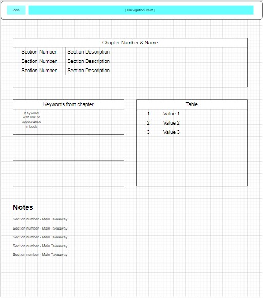

# Welcome to JavaContinued

This is an example of what I learned in LaunchCode's LC101 course. This serves as general practice due to the saying,
if you don't use it, you lose it.

## Initial Design

I am going to create a page for each chapter in [the book](https://education.launchcode.org/java-independent-track/index.html) and each page will contain sections:
 - Chapter Contents
 - Keywords
 - Core Concepts
 - My notes, or main takeaways

## Future Work

After I complete the initial work, I want to add in other technologies, such as:
 - BackstopJS for Visual Regression Testing
 - Other items for Accessibility Testing
 - CI/CD
 - New (to me) styling frameworks

